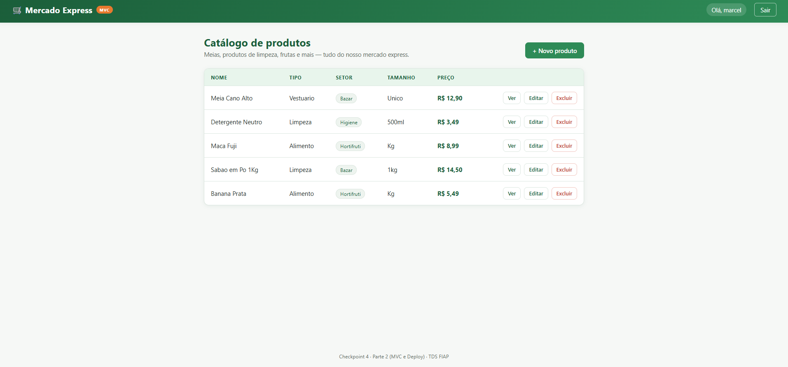
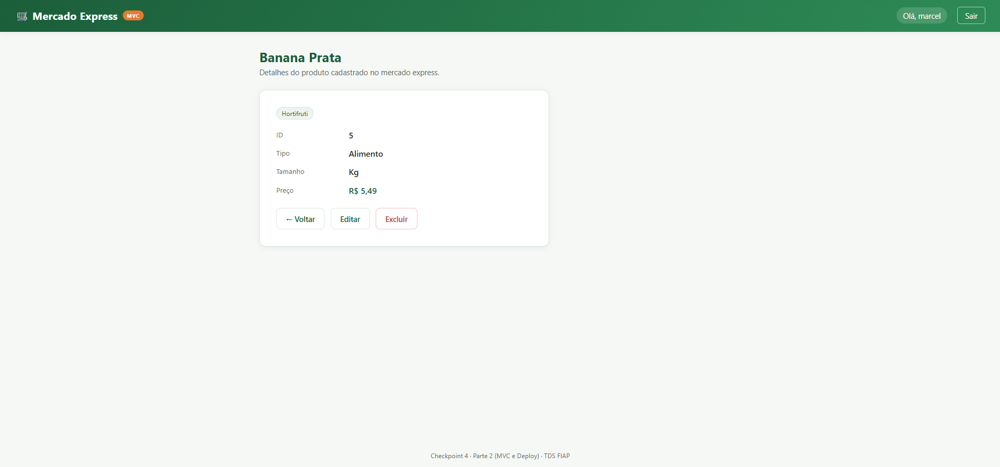
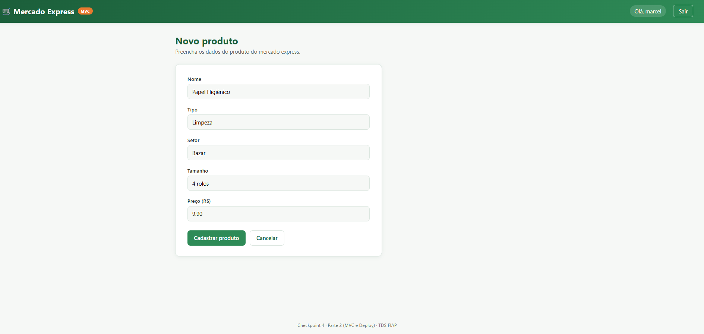
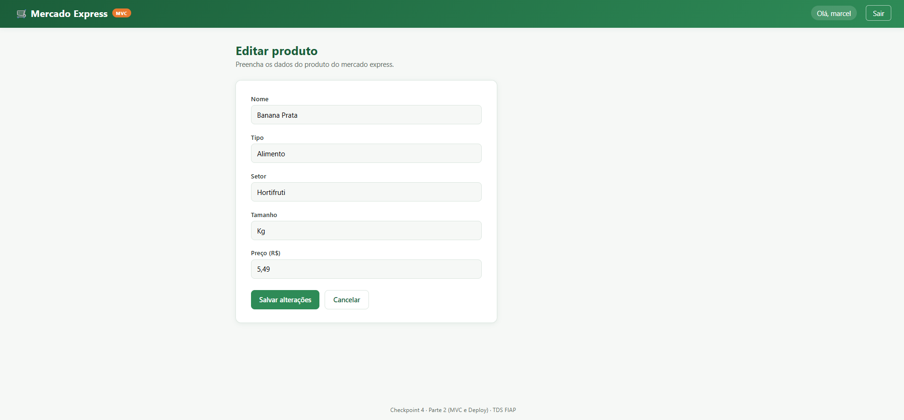
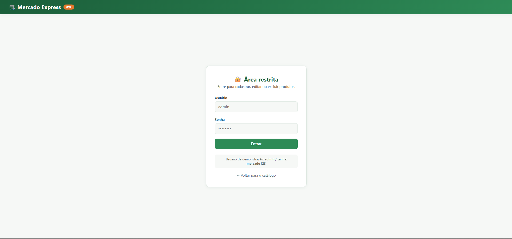
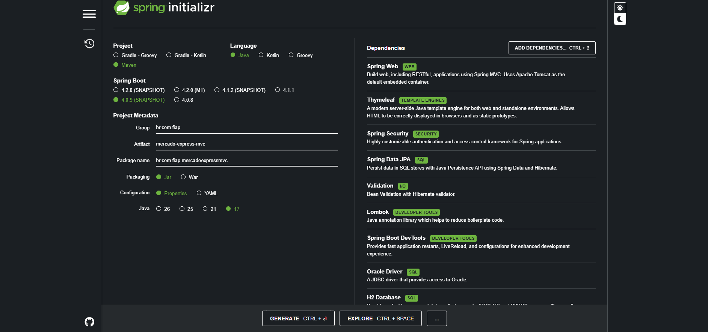

# 🛒 Mercado Express — MVC (Checkpoint 4, Parte 2)

Projeto acadêmico desenvolvido para o **Checkpoint 4 — Parte 2 (MVC e Deploy)** da disciplina de **Tecnologia em Análise e Desenvolvimento de Sistemas (TDS)** na **FIAP**, sob orientação do **Prof. Dr. Marcel Stefan Wagner**.

> Este repositório contém **apenas a Parte 2** do Checkpoint 4 (interface Web / Spring MVC), separada da Parte 1 (API REST), conforme exigido pelo enunciado. O repositório da Parte 1 está em: **https://github.com/Rcsilva05/mercado-express-api**

## Sumário

- [Sobre o projeto](#sobre-o-projeto)
- [Integrantes](#integrantes)
- [Tecnologias utilizadas](#tecnologias-utilizadas)
- [IDE utilizada](#ide-utilizada)
- [Modelo de dados](#modelo-de-dados)
- [Como rodar localmente](#como-rodar-localmente)
- [Funcionalidades e telas (CRUD)](#funcionalidades-e-telas-crud)
- [Segurança (Spring Security)](#segurança-spring-security)
- [Configuração do Spring Initializr](#configuração-do-spring-initializr)
- [Deploy](#deploy)
- [Vídeo de demonstração](#vídeo-de-demonstração)
- [Estrutura do projeto](#estrutura-do-projeto)

---

## Sobre o projeto

Aplicação Web desenvolvida com **Spring Boot + Spring MVC + Thymeleaf** para uma empresa fictícia do tipo **mercado express** (meias, produtos de limpeza, frutas, etc). A aplicação implementa o CRUD completo (**C**reate, **R**ead, **U**pdate, **D**elete) de produtos através de uma interface Web navegável — sem a necessidade de Postman/Insomnia, como na Parte 1 — com formulários, listagem, tela de detalhes, autenticação e controle de acesso via **Spring Security**.

O tema segue o mesmo da Parte 1: um mercado express que vende produtos como meias, produtos de limpeza e frutas.

## Integrantes

| Nome | RM |
|---|---|
| Rodrigo Carvalho Silva | 565162 |
| Nickolas Davi | 564105 |
| Samara Vilela | 566133 |
| Natália Cristina | 564099 |
| Otávio Ferreira | 565960 |

**Turma:** *(preencher com o código da turma — ex: 1TDSPY)*

## Tecnologias utilizadas

- **Java 17**
- **Spring Boot 3.2.5** (Maven)
- **Spring MVC** — camada Web (Controllers)
- **Thymeleaf** — motor de templates para renderização das páginas HTML
- **Spring Security** — autenticação e autorização (rotas públicas/privadas)
- **Spring Data JPA / Hibernate** — persistência
- **Oracle Database** (`ORACLE_FIAP`, driver `ojdbc11`) — mesmo banco utilizado na Parte 1
- **H2 Database** — perfil alternativo em memória, usado no ambiente de deploy público (ver seção [Deploy](#deploy))
- **Lombok** — redução de boilerplate (getters/setters/construtores)
- **Bean Validation** — validação dos formulários

## IDE utilizada

**IntelliJ IDEA** (mesma IDE utilizada na Parte 1).

## Modelo de dados

A aplicação consulta uma tabela própria, **separada** da tabela usada na Parte 1, mas no mesmo banco Oracle (`ORACLE_FIAP`):

**Tabela:** `TDS_MVC_TB_MERCADO`
**Sequence:** `SEQ_TDS_MVC_TB_MERCADO`

| Coluna | Tipo | Descrição |
|---|---|---|
| `ID` | `NUMBER(19,0)` | Chave primária, gerada pela sequence |
| `NOME` | `VARCHAR2(100)` | Nome do produto (obrigatório) |
| `TIPO` | `VARCHAR2(50)` | Categoria (ex: Vestuário, Limpeza, Alimento) |
| `SETOR` | `VARCHAR2(50)` | Departamento (ex: Bazar, Higiene, Hortifruti) |
| `TAMANHO` | `VARCHAR2(30)` | Tamanho/quantidade (ex: P/M/G, 500ml, 1kg) |
| `PRECO` | `NUMBER(10,2)` | Preço do produto |

O script de criação manual da tabela (para rodar no SQL Developer, caso o usuário do Oracle FIAP não tenha permissão de DDL automático) está em [`scripts/create_table.sql`](scripts/create_table.sql).

## Como rodar localmente

### Pré-requisitos
- JDK 17+
- Maven 3.8+
- Acesso à rede/VPN da FIAP (apenas se for usar o perfil `oracle`)

### Passo a passo

```bash
git clone <URL_DESTE_REPOSITORIO>
cd mercado-express-mvc
```

**Opção A — rodar com o banco H2 em memória (mais simples, não precisa de VPN):**

```bash
mvn spring-boot:run -Dspring-boot.run.profiles=h2
```

A aplicação sobe com alguns produtos de exemplo já cadastrados (ver [`data.sql`](src/main/resources/data.sql)).

**Opção B — rodar contra o Oracle FIAP (mesmo banco da Parte 1):**

```bash
export DB_USER=RM565960
export DB_PASSWORD=<senha do Oracle FIAP>
mvn spring-boot:run -Dspring-boot.run.profiles=oracle
```

> Antes de rodar no perfil `oracle`, execute o script [`scripts/create_table.sql`](scripts/create_table.sql) no SQL Developer para criar a tabela `TDS_MVC_TB_MERCADO` e a sequence, caso ainda não existam.

Em ambos os casos, a aplicação sobe em:

```
http://localhost:8083/produtos
```

## Funcionalidades e telas (CRUD)

Todas as ações do CRUD estão disponíveis como **links e botões** na interface Web (nenhuma exigida via Postman/Insomnia nesta parte).

| Ação | Rota | Descrição |
|---|---|---|
| **Read** (listar) | `GET /produtos` | Lista todos os produtos cadastrados, em tabela |
| **Read** (detalhe) | `GET /produtos/{id}` | Mostra os detalhes de um produto específico |
| **Create** (formulário) | `GET /produtos/novo` | Exibe o formulário de cadastro |
| **Create** (salvar) | `POST /produtos` | Salva um novo produto no banco |
| **Update** (formulário) | `GET /produtos/{id}/editar` | Exibe o formulário preenchido para edição |
| **Update** (salvar) | `POST /produtos/{id}` | Atualiza os dados do produto |
| **Delete** | `POST /produtos/{id}/excluir` | Remove o produto do banco (com confirmação) |

### 1. Tela de listagem (`/produtos`)

Exibe todos os produtos cadastrados em formato de tabela, com nome, tipo, setor, tamanho e preço. Cada linha tem botões de **Ver**, **Editar** e **Excluir** (os dois últimos visíveis apenas para usuários autenticados). Usuários não logados veem apenas a listagem e o botão **Entrar**.



### 2. Tela de detalhe (`/produtos/{id}`)

Mostra todas as informações de um produto específico.



### 3. Formulário de cadastro (`/produtos/novo`)

Formulário com validação (nome, tipo, setor e preço são obrigatórios). Ao submeter, os dados são enviados via `POST /produtos`, processados pelo `ProdutoController`, passados pela camada de serviço (`ProdutoService`) e persistidos no banco através do `ProdutoRepository` (Spring Data JPA / Entity Manager).



### 4. Formulário de edição (`/produtos/{id}/editar`)

Mesmo formulário do cadastro, pré-preenchido com os dados do produto. Ao submeter, envia `POST /produtos/{id}`, que atualiza o registro existente.



### 5. Exclusão

Botão **Excluir** (na listagem e no detalhe) pede confirmação via JavaScript (`confirm()`) e, ao confirmar, envia `POST /produtos/{id}/excluir`, removendo o registro do banco pelo ID.

### 6. Tela de login (`/login`)

Formulário de autenticação do Spring Security. Usuário de demonstração:

```
usuário: admin
senha:   mercado123
```



## Segurança (Spring Security)

A aplicação define **rotas públicas** e **rotas privadas**, configuradas em [`SecurityConfig.java`](src/main/java/br/com/fiap/mercadoexpressmvc/config/SecurityConfig.java):

**Rotas públicas** (qualquer visitante, sem login):
- `GET /produtos` — listagem
- `GET /produtos/{id}` — detalhe
- `/login` — página de login
- `/css/**`, `/img/**` — recursos estáticos

**Rotas privadas** (exigem login como usuário `admin`):
- `GET /produtos/novo` e `POST /produtos` — criar
- `GET /produtos/{id}/editar` e `POST /produtos/{id}` — atualizar
- `POST /produtos/{id}/excluir` — excluir

O usuário é definido em memória (`InMemoryUserDetailsManager`) com senha criptografada via `BCryptPasswordEncoder` — adequado ao escopo acadêmico deste checkpoint. A interface Web (Thymeleaf) usa a extensão `thymeleaf-extras-springsecurity6` para exibir/ocultar botões de acordo com o estado de autenticação (`sec:authorize="isAuthenticated()"`).

## Configuração do Spring Initializr



Configuração utilizada:

- **Project:** Maven · **Language:** Java · **Spring Boot:** 3.2.5
- **Group:** `br.com.fiap` · **Artifact:** `mercado-express-mvc` · **Java:** 17
- **Dependências:** Spring Web, Thymeleaf, Spring Security, Spring Data JPA, Validation, Lombok, Spring Boot DevTools, Oracle Driver, H2 Database

## Deploy

O deploy foi feito na plataforma **Render** (https://render.com), via **Docker** (ver [`Dockerfile`](Dockerfile) e [`render.yaml`](render.yaml)).

> **Sobre o banco de dados em produção:** o Oracle `ORACLE_FIAP` só é acessível de dentro da rede/VPN da faculdade, então não é alcançável por uma plataforma pública de deploy como o Render. Por isso, o ambiente publicado roda com o **perfil `h2`** (banco em memória, com os mesmos dados de exemplo do `data.sql`), preservando toda a funcionalidade do CRUD e do Spring Security para fins de demonstração. Localmente, ou em qualquer ambiente com acesso à rede da FIAP, a aplicação roda normalmente contra o Oracle real usando o perfil `oracle` (ver [Como rodar localmente](#como-rodar-localmente)).

**Link de produção:** `[PREENCHER APÓS O DEPLOY -> ex: https://mercado-express-mvc.onrender.com/produtos]`

### Passo a passo do deploy (Render)

1. Suba este repositório para o seu GitHub (`git push`).
2. Acesse [render.com](https://render.com) e faça login (pode usar sua conta GitHub).
3. Clique em **New +** → **Web Service**.
4. Conecte o repositório `mercado-express-mvc`.
5. O Render detecta o `Dockerfile` automaticamente (ambiente: **Docker**). Caso peça, selecione o plano **Free**.
6. Em **Environment**, confirme a variável `SPRING_PROFILES_ACTIVE=h2` (já definida no `render.yaml`/`Dockerfile`).
7. Clique em **Create Web Service** e aguarde o build (leva alguns minutos).
8. Ao final, o Render fornece uma URL pública (`https://<nome-do-servico>.onrender.com`) — acesse `/produtos` para ver a aplicação.
9. Copie essa URL e cole no arquivo `.txt` de entrega e neste README (campo **Link de produção** acima).

## Vídeo de demonstração

*(Inserir aqui o link do vídeo de ~5 minutos mostrando as funcionalidades e endpoints da interface Web — ex: link do YouTube (não listado) ou Google Drive)*

`[PREENCHER -> link do vídeo]`

## Estrutura do projeto

```
mercado-express-mvc/
├── Dockerfile                     # build/deploy via Docker (Render)
├── render.yaml                    # blueprint de deploy do Render
├── pom.xml
├── scripts/
│   └── create_table.sql           # script manual para criar a tabela no Oracle FIAP
├── docs/                          # prints de tela (README)
├── integrantes.txt                # nomes, RMs, link do GitHub, link do deploy, IDE
└── src/main/
    ├── java/br/com/fiap/mercadoexpressmvc/
    │   ├── MercadoExpressMvcApplication.java
    │   ├── model/Produto.java
    │   ├── repository/ProdutoRepository.java
    │   ├── service/ProdutoService.java
    │   ├── controller/ProdutoController.java
    │   ├── controller/HomeController.java
    │   └── config/SecurityConfig.java
    └── resources/
        ├── application.properties         # perfil ativo (default: oracle)
        ├── application-oracle.properties  # config do banco Oracle FIAP
        ├── application-h2.properties      # config do banco H2 (deploy/demo)
        ├── data.sql                       # dados de exemplo (perfil h2)
        ├── static/css/style.css
        └── templates/
            ├── login.html
            └── produtos/
                ├── lista.html
                ├── form.html
                ├── detalhe.html
                └── nao-encontrado.html
```

---

*"Quem ouve, esquece. Quem vê, lembra. Quem faz, aprende."* — Provérbio chinês.
